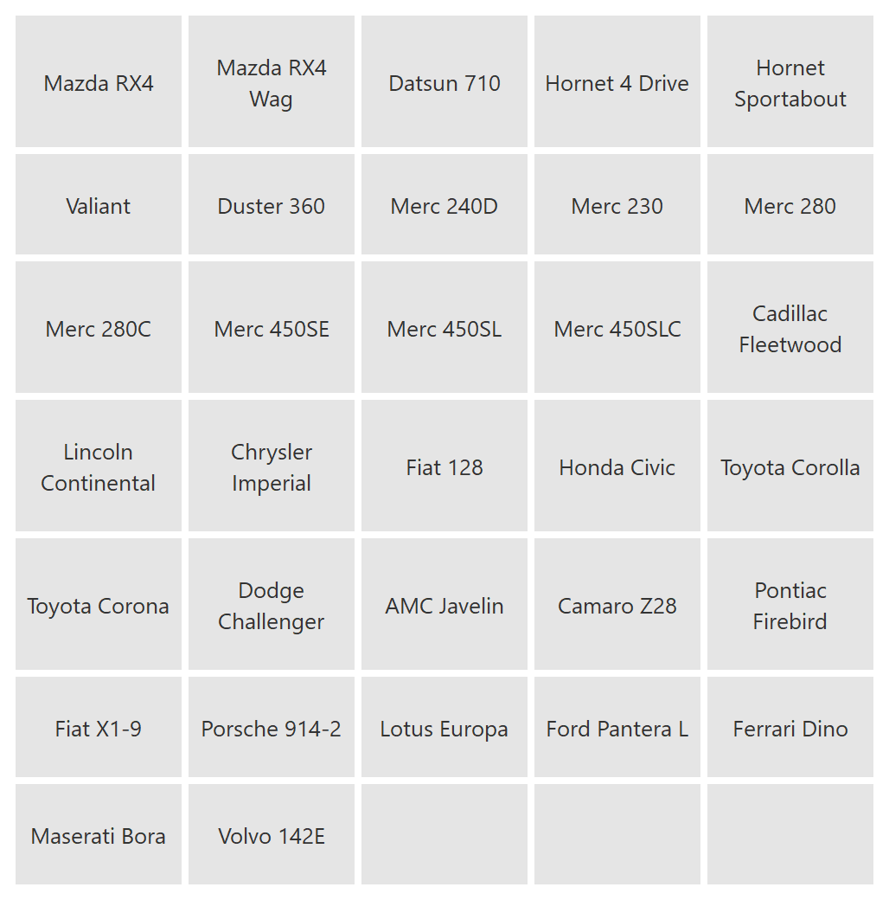
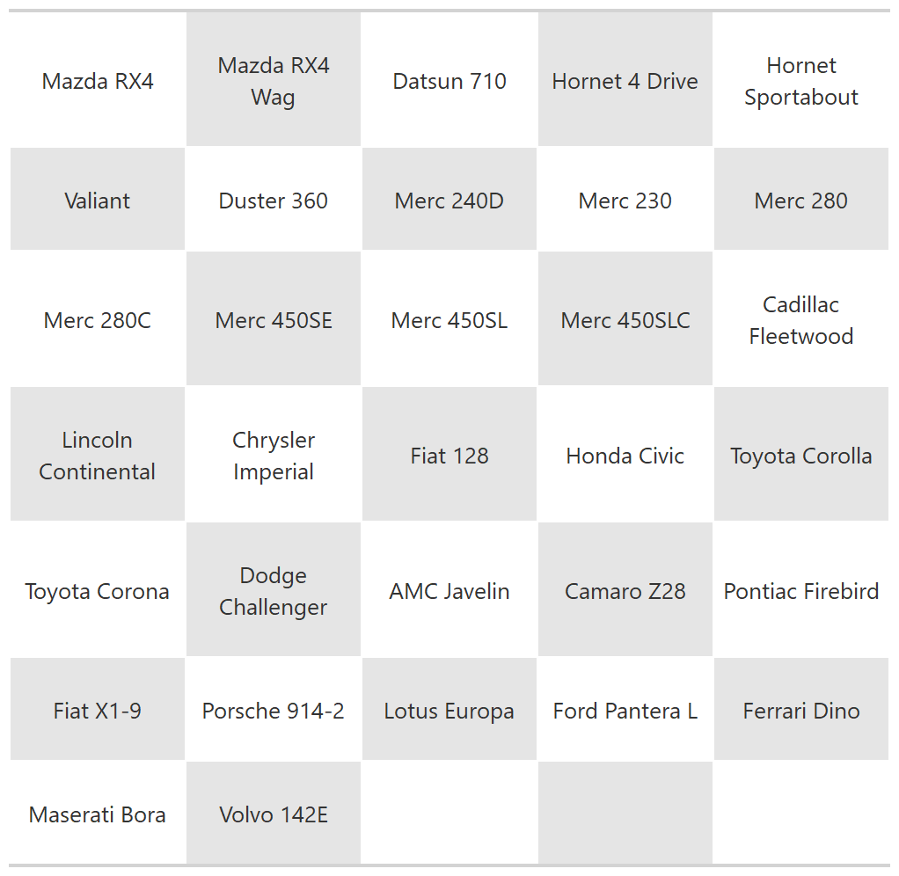
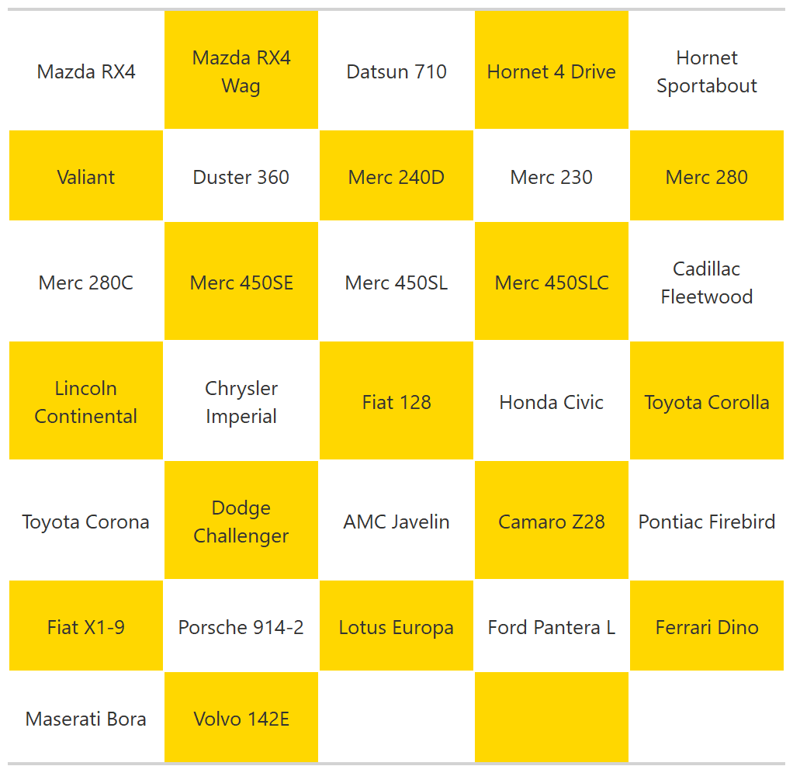

<!-- README.md is generated from README.Rmd. Please edit that file -->

```{r, include = FALSE}
knitr::opts_chunk$set(
  collapse = TRUE,
  comment = "#>",
  fig.path = "man/figures/README-",
  out.width = "100%"
)
```

# gridup

<!-- badges: start -->
<!-- badges: end -->

The goal of gridup is to quickly and easily present a vector of strings in a visual manner. When writing reports we may need to present a large number of strings in our document, for example, a large number of keywords used in a database search, or a list of business names. We can paste them into our document separated by commas or in a bullet point list, but if the list is large, this becomes impractical and visually unappealing. 

The sole function of grid up is to neatly squash your strings together into a grid figure that can be easily inserted into documentation. 

## Installation

You can install the released version of gridup from GitHub with:

``` r
remotes::install_github("rachelannieswain/gridup")
```

## Usage

```{r example}
library(gridup)
library(gt)

# Your vector of strings
cars <- mtcars %>% rownames()
```

### Grid layout
```{r grid, warning=FALSE, message=FALSE, out.width ="70%"}
grid_output <- gridup::grid_up(strings = cars, output_type = "grid") %>%
  gtsave(here::here("images", "grid-output.png"))


```

### Checkerboard layout
```{r checkerboard, warning=FALSE, message=FALSE, out.width ="70%"}
checkerboard_output <- gridup::grid_up(strings = cars, output_type = "checkerboard") %>%
  gtsave(here::here("images", "check-output.png"))




```

### Changing background colour
```{r colours, warning=FALSE, message=FALSE, out.width ="70%"}
coloured_grid <- gridup::grid_up(strings = cars, output_type = "checkerboard", bg_colour = "gold") %>%
  gtsave(here::here("images", "coloured-output.png"))


```

